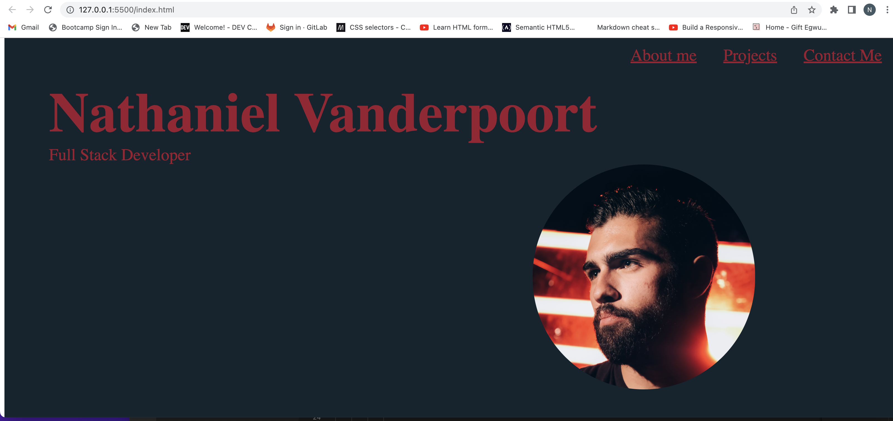

# Nathaniel Vanderpoort Online Portfolio
## Description
#
This is my web portfolio that tells the user a bit about myself and the projects I've recently worked on.

## Installation 
#
The web page was installed through pushing local html and css into github.

## Usage
#
This site's navigation bar in the upper right hand corner allows users to quickly explore each part of the online portfolio. The website's sections include: About me, Projects, and Contact Me.
## Credits
#
Credit goes to the staff for providing us with a cool assignment to showcase what we have learned so far. Also, credit goes to github.com considering I used their logo as a link at the bottom of the page. 

## License
#
N/A
## Deployment Link 
#

